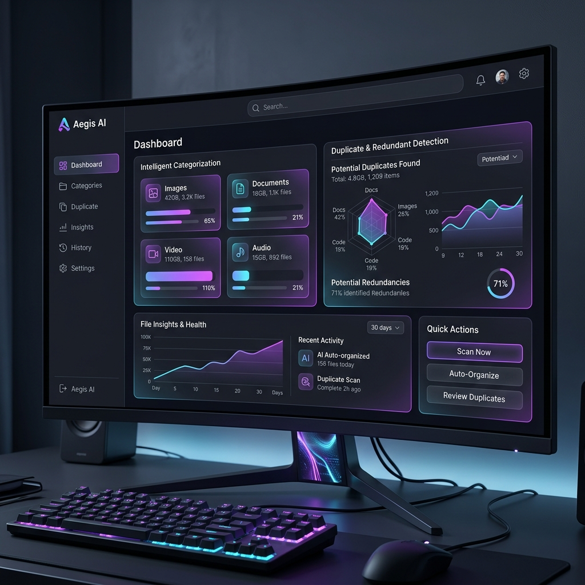
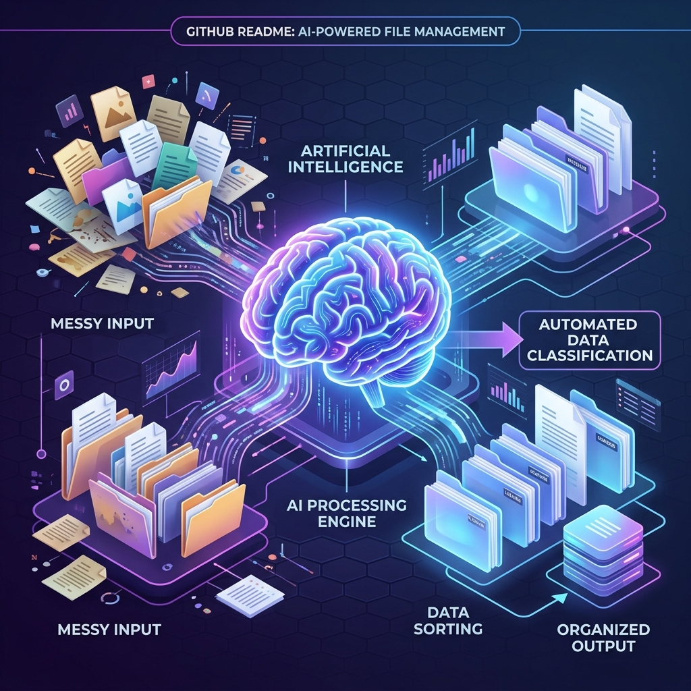

<div align="center">
  

  # 🌌 Titan Ultra AI Organizer

  **Advanced AI-Powered Desktop Organization System**

  [](https://python.org)
  [](https://opensource.org/licenses/MIT)
  [](https://github.com/ALM3SHI/Titan-Ultra-AI-Organizer)
  []()

  *Intelligent file categorization, duplicate detection, and automated pattern learning using SQLite for local data tracking with a modern, high-performance GUI.*
</div>

---

## 🎯 Executive Vision (For Managers & Leaders)

**Titan Ultra AI Organizer** is not just a file manager—it is a smart, autonomous desktop companion designed to save hundreds of hours of manual work. As digital assets and files accumulate rapidly, employees and individuals lose valuable time searching, organizing, and cleaning up their digital workspace. 

Our system uses **Artificial Intelligence** to learn your habits, automatically categorize files into meaningful folders, and detect redundant duplicates, all while keeping your data **100% private and local**.

### 💼 Why Titan?
- **Cost Reduction:** Eliminates wasted time spent manually organizing data.
- **Enhanced Productivity:** Finds the right files instantly using AI-driven context.
- **Resource Optimization:** Reclaims disk space by identifying hidden duplicate files.
- **Zero Privacy Risk:** All AI processing and data storage (via SQLite) happens entirely on your local machine.

---

## ✨ Core Features

- **🧠 Intelligent Pattern Learning:** The AI continuously learns from how you move and rename files, adapting its organization logic over time.
- **📂 Smart Categorization Engine:** Automatically groups files by context, project, or type (e.g., invoices, code, design assets).
- **🔍 Deep Duplicate Detection:** Uses advanced hashing and content analysis to find exact and near-match duplicates.
- **⚡ High-Performance Local DB:** Built on an optimized SQLite architecture for lightning-fast indexing of millions of files.
- **🎨 Premium GUI:** A breathtaking, state-of-the-art dark mode interface featuring glassmorphism, fluid animations, and real-time analytics.

---

## ⚙️ How It Works

<div align="center">
  
</div>

1. **Scan & Index:** Titan securely scans your selected directories and builds a high-speed local SQLite index.
2. **AI Analysis:** The embedded AI engine analyzes file metadata, content structures, and your past organizational habits.
3. **Automated Action:** Titan silently categorizes files into logical folders and flags unnecessary duplicates for your review.
4. **Learn & Improve:** With every action you approve or modify, the AI updates its internal weights to serve you better next time.

---

## 🏗️ Technical Architecture & Structure

Designed with enterprise-grade standards, our codebase is modular, scalable, and heavily documented.

```text
Titan-Ultra-AI-Organizer/
│
├── assets/                 # High-resolution media, banners, and diagrams
├── config/                 # Application configuration and AI hyperparameters
├── docs/                   # Developer documentation and API references
├── src/                    # Main source code
│   ├── ai_engine/          # Pattern learning and categorization models
│   ├── core/               # File system operations and SQLite DB handlers
│   └── gui/                # Modern UI components and state management
├── tests/                  # Unit and integration tests for CI/CD
├── .gitignore              # Python specific ignores
├── LICENSE                 # MIT License
└── README.md               # You are here!
```

---

## 🚀 Getting Started

*(Development Phase)*

**Prerequisites:**
- Python 3.9+
- pip (Python package installer)

**Installation:**
```bash
# Clone the repository
git clone https://github.com/ALM3SHI/Titan-Ultra-AI-Organizer.git

# Navigate into the project
cd Titan-Ultra-AI-Organizer

# Install dependencies (coming soon)
pip install -r requirements.txt

# Run the application
python src/gui/main.py
```

---

## 📜 License

This project is licensed under the **MIT License** - see the [LICENSE](LICENSE) file for details.

<div align="center">
  <i>Built with passion by <a href="https://github.com/ALM3SHI">ALM3SHI</a> and AI.</i>
</div>
